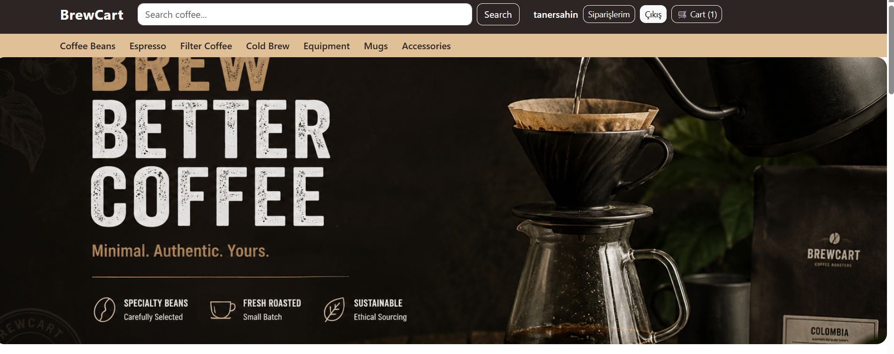
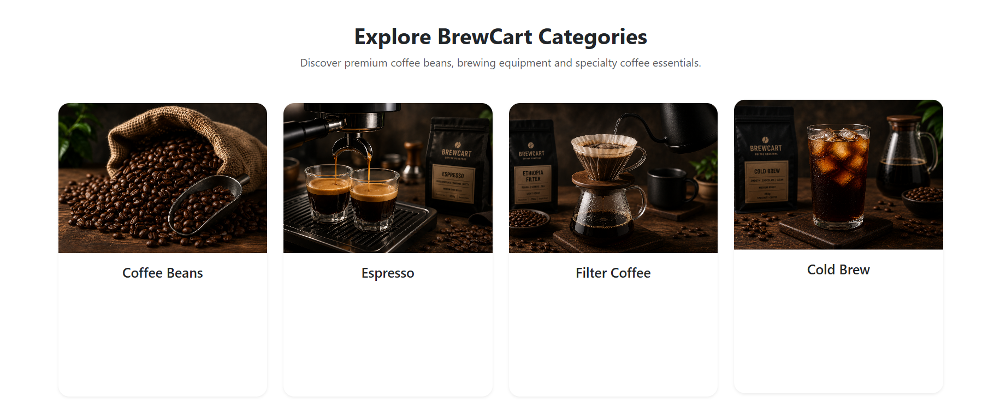
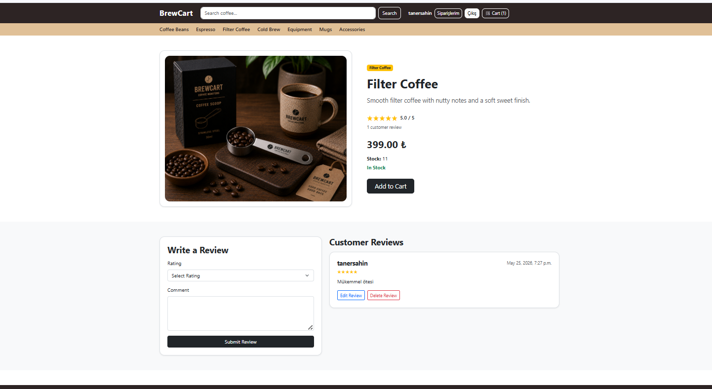
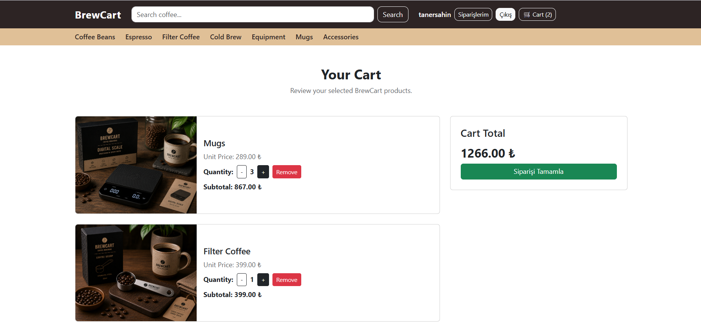
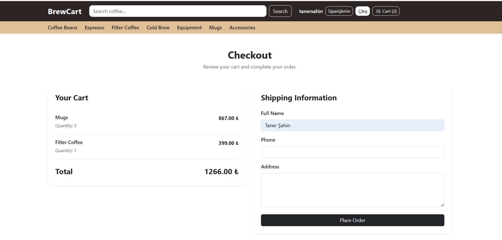
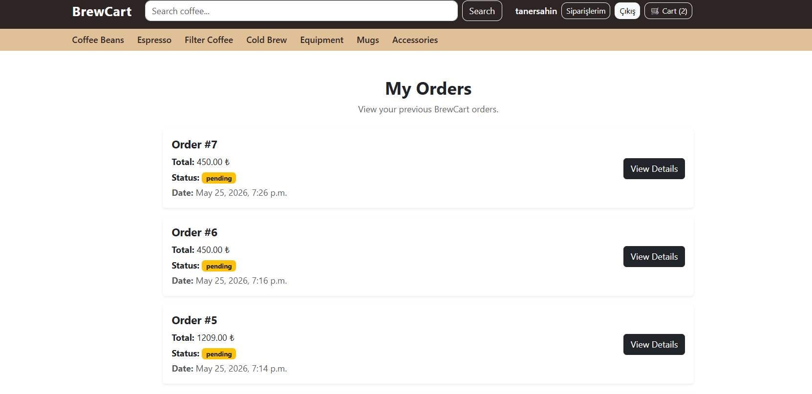
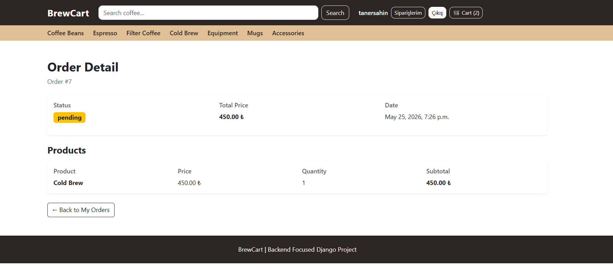
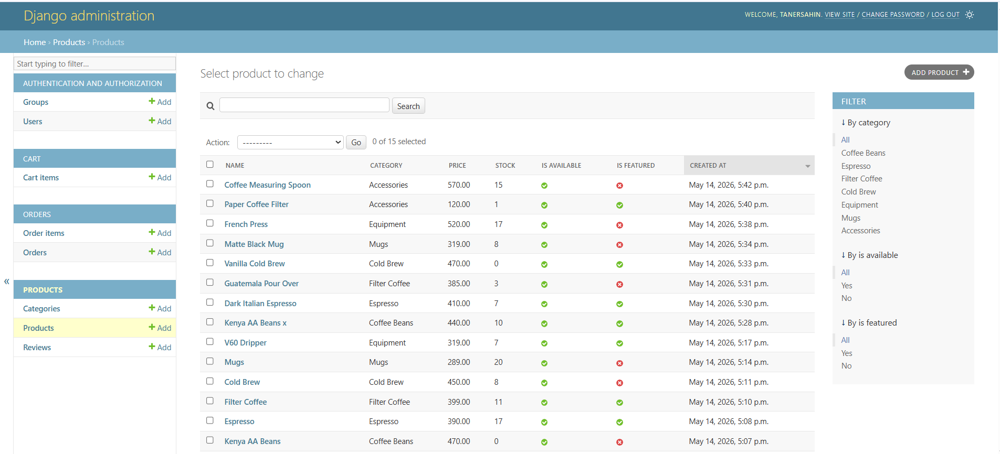

# ☕ BrewCart

Backend-focused Django specialty coffee e-commerce project built with scalable backend architecture, advanced queryset filtering, dynamic search systems, review workflows, and database-driven cart logic.

## 🌐 Live Demo

[BrewCart Live Website](https://brewcart-django.onrender.com)

---

# 🖼️ Screenshots

## 🏠 Home Page

---

## 🗂 Category System

---

## 📄 Product Detail

---

## 🛒 Cart System

---

## 📦 Checkout System

---

## 📋 My Orders

---

## 📄 Order Detail

---

## ⚙️ Admin Product Management

---

## 📦 Admin Order Management

---

# 🧠 About

BrewCart is a backend-focused Django specialty coffee e-commerce project built to simulate real-world backend systems using scalable and reusable backend architecture.

The project focuses heavily on:

- advanced queryset filtering
- search systems
- database-driven cart architecture
- order workflows
- review systems
- scalable backend development

rather than frontend complexity.

---

# 🎯 Main Focus

Building advanced filtering, search systems, queryset logic, review architecture, and scalable backend workflows using Django ORM.

---

# ⚙️ Core Features

## 🔐 Authentication
- User registration
- Login / Logout
- Protected checkout system
- User-based cart logic
- User-based order history

---

## 🛍 Product System
- Dynamic product listing
- Slug-based product detail pages
- Category filtering
- Dynamic category navbar
- Featured products section
- Product availability system

---

## 🔎 Advanced Search & Filtering

### Query Features
- request.GET architecture
- Dynamic queryset filtering
- Q object search logic
- Multi-field search system
- Search by category name
- Search by description

### Filter Features
- Category filtering
- Price min / max filtering
- In-stock filtering
- Sorting system

### Ordering Options
- Price low → high
- Price high → low

---

## ⭐ Review & Rating System

### User Features
- Add review
- Edit review
- Delete review
- Give 1–5 star rating
- Product review listing

### Backend Logic
- ForeignKey relationships
- related_name usage
- Avg() aggregation
- Dynamic rating calculation
- One review per user protection

---

## 🛒 Database-Based Cart System
- Add products to cart
- Increase / decrease quantity
- Remove cart items
- Dynamic navbar cart count
- User-specific cart storage
- Database-driven architecture
- NOT session-based

---

## 📦 Order System
- Checkout workflow
- Order creation
- OrderItem snapshot logic
- Automatic cart cleanup
- Stock reduction
- My Orders page
- Order detail page
- Admin order management

---

# 🚀 Backend Highlights

- Advanced queryset filtering
- Dynamic search system
- Q object implementation
- request.GET architecture
- Aggregate functions
- Avg() usage
- Database-driven cart system
- Snapshot order logic
- Slug-based clean URLs
- User-based data isolation
- Dynamic navbar architecture
- Backend-first project structure

---

# 🔄 Business Flow

User registers  
→ Logs in  
→ Searches products  
→ Filters products dynamically  
→ Opens product detail page  
→ Adds products to cart  
→ Cart stored in database  
→ Checkout process starts  
→ Order is created  
→ OrderItems generated  
→ Stock reduced automatically  
→ Cart cleared automatically  
→ User tracks orders from My Orders page

---

# 🛠 Tech Stack

- Python
- Django
- SQLite
- Bootstrap 5
- WhiteNoise
- Gunicorn
- Render

---

# 🧩 Project Structure

accounts → authentication system  
products → products, filtering & reviews  
cart → database-based cart system  
orders → checkout & order management  
templates → global templates  
static → CSS, JS, images  
media → uploaded product images  

---

# 📚 What I Learned

- Building advanced queryset systems
- Implementing dynamic product filtering
- Using request.GET professionally
- Using Q objects for search logic
- Working with aggregate functions
- Building review & rating systems
- Structuring scalable Django backends
- Creating database-driven cart architecture
- Managing user-based order workflows
- Building reusable backend architecture
- Deploying Django projects to production

---

# 📊 Status

✅ Backend Systems Completed

### Completed Features
- Authentication System
- Dynamic Product System
- Slug-Based URLs
- Advanced Search & Filtering
- Q Object Search Logic
- Database-Based Cart
- Stock Guard System
- Checkout & Order Workflow
- Review & Rating System
- Dynamic Navbar
- User Order History
- Admin Order Management
- Bootstrap UI Polish
- GitHub Showcase Structure

---

# 🚀 Live Deployment

BrewCart is fully deployed on Render.

Production topics implemented:

- Gunicorn
- WhiteNoise
- Static files management
- Production settings
- Environment variables
- DEBUG=False deployment workflow

---

# 💡 Project Philosophy

This project was built with a backend-first mindset.

The primary goal was not visual complexity, but:

- scalable backend architecture
- reusable Django systems
- real-world e-commerce workflows
- clean backend logic
- professional project structure

---

# 🗺 Backend Journey Roadmap

Project 1 → SnapCart ✅  
Project 2 → OrderCore ✅  
Project 3 → StockFlow ✅  
Project 4 → CouponCart ✅  
Project 5 → VariShop ✅  
Project 6 → BrewCart ✅  
Project 7 → SaveBasket 🔜

---

# 👤 Author

Taner Sahin

GitHub:  
https://github.com/taner-sahin